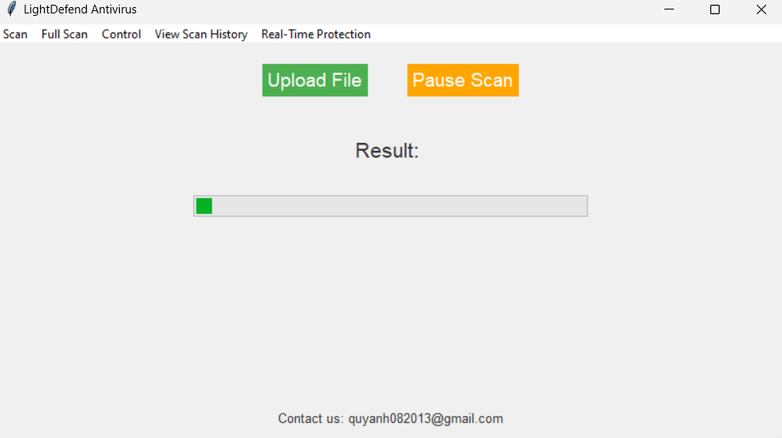

# LightDefense Antivirus

LightDefense is an antivirus designed to scan your files. We offer a unique feature called Full Scan, which scans your entire device. Our antivirus can handle active viruses (currently in alpha). Contact us to report bugs at quyanh082013@gmail.com. The antivirus is currently in beta testing, so please use it with caution.

# Features :
- File Scan.
- Real-time protection
- Full Scan( Device Scan )
- Manual File Scan
- Remove Malicious File
- Tkinter UI

# Screenshot :

# CREDIT :
- Quy Anh Nguyen - Developer
- Umut Camliyurt - Developer
