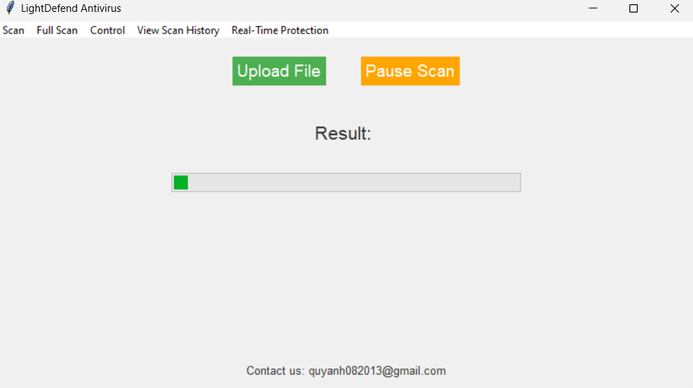

# LightDefense

<!-- DESCRIPTION -->
## Description:

Scanning files anonymously on VirusTotal offers a multitude of benefits, primarily revolving around privacy and security. By submitting files anonymously, users can protect sensitive information from being linked to their identity, ensuring confidentiality. This anonymity also shields users from potential retribution or targeting by malicious actors who may take offense to the file submissions. LightDefense is a tool for anonymously scanning files on VirusTotal.

***Warning: Please be mindful of user privacy when uploading files to services like VirusTotal, as it can potentially expose sensitive information to third parties.***

<!-- FEATURES -->
## Features for normal version( Beta ) :

- File Scan
- Device Scan( Alpha Testing )
- Tkinter GUI

## Features for version 2.0( Alpha ) :

- File scan
- Manual file scan
- Real time protection for downloads
- Connects to VirusTotal using [Tor](https://en.wikipedia.org/wiki/Tor_(network)) for anonymity
- Tkinter GUI

<!-- INSTALLATION -->
## Installation

1. Download it on github.
2. Just open the app after you downloaded it.

<!-- SCREENSHOT -->
## Screenshot of version 2.0:

<!-- CREDITS -->
## Credits:

- Quy Anh Nguyen - Developer,
- Umut Camliyurt - Developer, 
- VirusTotal - Database Provider
